# Current Tuning Code Flow

This diagram reflects the current backend flow after the skill/provider/policy
refactor. The pipeline is now skill-first with algorithm fallbacks kept for
compatibility.

```mermaid
flowchart TD
    UI["Frontend TuningPage"] --> API["FastAPI tuning_routes"]
    API --> Runner["core.pipeline.runner.run_tuning_pipeline"]

    Runner --> DataStage["Stage: data_analysis"]
    DataStage --> LoadSkill["Skill: load_dataset"]
    LoadSkill --> LoadProvider["Provider: dataset_loading / clean_csv_loader"]
    LoadProvider --> DataAlg["Algorithm: data_analysis._load_clean_only"]
    DataStage --> WindowDetectSkill["Skill: detect_windows"]
    WindowDetectSkill --> WindowDetectProvider["Provider: window_detection / history_rule_based"]
    WindowDetectProvider --> WindowAlg["Algorithm: data_analysis.build_candidate_windows"]
    DataStage -. fallback .-> LegacyData["Algorithm fallback: load_and_prepare_dataset"]

    Runner --> ProfileSkill["Skill: summarize_data"]
    ProfileSkill --> ProfileProvider["Provider: data_profile / deterministic_profile"]
    ProfileProvider --> ProfileAnalyzers["Analyzers: data_understanding._analyzers"]

    Runner --> WindowStage["Stage: window_selection"]
    WindowStage --> SelectWindowSkill["Skill: select_window"]
    SelectWindowSkill --> SelectWindowProvider["Provider: window_selection / quality_score_selector"]
    WindowStage --> WindowLLM["Optional LLM: choose_window_via_llm"]

    Runner --> IdentifyStage["Stage: identification"]
    IdentifyStage --> IdentifySkill["Skill: identify_model"]
    IdentifySkill --> IdentifyProvider["Provider: identification / transfer_function_fit"]
    IdentifyProvider --> SystemIdAlg["Algorithm: system_id.fit_best_model"]
    SystemIdAlg --> LoopPriors["Policy: loop_priors"]
    IdentifyStage -. fallback .-> SystemIdFallback["Algorithm fallback: fit_best_model"]

    Runner --> ReviewStage["Stage: model_review"]
    ReviewStage --> ReviewLLM["LLM advisor: review_identification_via_llm"]
    ReviewLLM --> RefineLLM["LLM advisor: ask_refinement_via_llm"]
    RefineLLM --> IdentifyStage

    Runner --> TuningStage["Stage: tuning"]
    TuningStage --> TuningSkill["Skill: generate_tuning_candidates"]
    TuningSkill --> TuningAggregate["Provider: tuning / classic_family"]
    TuningAggregate --> IMC["Provider: tuning_strategy / imc"]
    TuningAggregate --> Lambda["Provider: tuning_strategy / lambda"]
    TuningAggregate --> ZN["Provider: tuning_strategy / zn"]
    TuningAggregate --> CHR["Provider: tuning_strategy / chr"]
    IMC --> TuningRules["Algorithm: pid_tuning.apply_tuning_rules"]
    Lambda --> TuningRules
    ZN --> TuningRules
    CHR --> TuningRules
    TuningAggregate --> Constraints["Policy: constraints"]
    TuningStage -. fallback .-> TuningFallback["Algorithm fallback: select_best_strategy"]

    Runner --> EvalStage["Stage: evaluation"]
    EvalStage --> EvalSkill["Skill: evaluate_tuning"]
    EvalSkill --> EvalAggregate["Provider: evaluation / closed_loop_sim"]
    EvalAggregate --> SimProvider["Provider: evaluation_simulation / closed_loop_response"]
    EvalAggregate --> ScoreProvider["Provider: evaluation_scoring / step_response_scoring"]
    EvalAggregate --> RealityProvider["Provider: evaluation_reality_check / adaptive_typical_t"]
    SimProvider --> EvalAlg["Algorithm: pid_evaluation._simulate"]
    ScoreProvider --> PerfAlg["Algorithm: pid_evaluation._performance_score"]
    RealityProvider --> ScoringPolicy["Policy: scoring_rules"]
    EvalAggregate --> ScoringPolicy
    EvalStage -. fallback .-> EvalFallback["Algorithm fallback: evaluate_pid_params"]

    Runner --> SSE["SSE events + final result"]
    SSE --> UI
```

## Notes

- `runner` remains the application orchestrator.
- `skills` are the stable business capabilities used by the pipeline.
- `providers` are the pluggable algorithm implementations.
- `policies` hold shared priors, constraints, and scoring caps.
- Existing algorithm functions are still present as compatibility fallbacks and
  low-level implementations behind providers.
