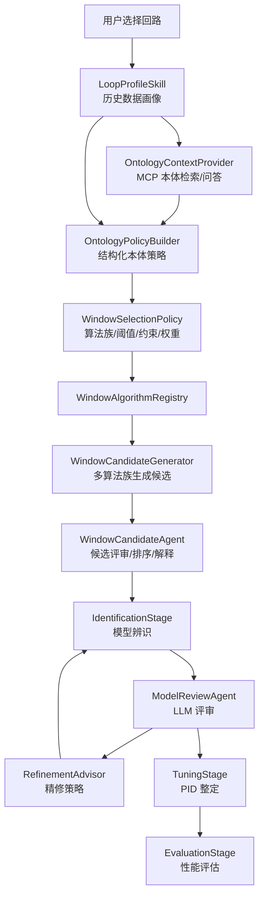
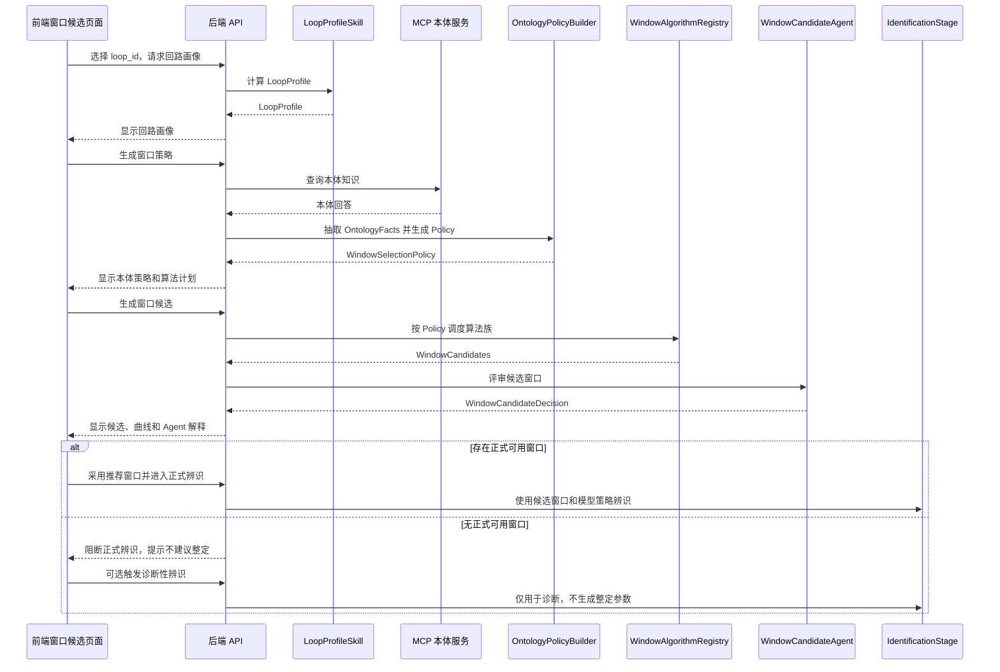

# 窗口候选智能体与最终架构改造设计方案

本文档用于沉淀当前 `pid_v2` 项目按“最终架构”逐步演进的改造方案。重点解决窗口候选、辨识、整定、监控、本体/MCP 与 LLM Agent 之间的职责边界，让后续算法可以插拔、前端可以解释、后端流程可以审计。

## 1. 背景与当前问题

当前系统已经具备历史数据导入、回路监控特征计算、窗口候选、模型辨识、LLM 评审、精修重试、PID 整定和性能评估等能力，但这些能力仍然有几个明显约束：

1. 窗口候选算法主要由确定性规则直接产生候选窗口，LLM 更多是在后置评审阶段解释和选择，尚未在“候选生成前”参与策略制定。
2. 回路本体知识已经可以通过 MCP 或本地 JSON 注入，但目前更像上下文补充，还没有形成结构化的 `WindowSelectionPolicy` 去约束算法族、阈值和评分权重。
3. `runner.py` 仍承担较多编排、策略判断、事件上报和兜底逻辑，长期看会让辨识链路变重，不利于替换算法。
4. 窗口算法族、窗口评分、模型辨识和 LLM 评审的边界仍可进一步清晰化，特别是“算法问题”和“数据问题”需要能被区分。
5. 前端已经有“窗口候选”“模型拟合曲线”“整定全流程详情”等页面雏形，但缺少完整展示“本体查询 -> 策略生成 -> 算法族执行 -> Agent 评审 -> 进入辨识”的过程。

因此，最终架构建议把窗口候选做成一个独立的智能体能力：它不直接替代确定性算法，而是先基于回路画像和本体知识生成策略，再调度多个窗口算法族，最后由 Agent 进行候选解释、排序和筛选。

## 2. 总体目标

改造目标不是把所有逻辑都交给 LLM，而是形成“确定性算法负责计算，LLM/本体负责策略和解释”的混合架构。

核心目标：

1. 回路画像独立：任何窗口候选、诊断、评估、整定准入都先读取统一的 `LoopProfile`。
2. 本体策略结构化：MCP 本体查询结果被抽取成 `OntologyFacts`，再生成 `WindowSelectionPolicy`。
3. 窗口算法可插拔：MV 阶跃、MV 斜坡、SP 阶跃、稳态扰动、滑窗扫描、领域约束窗口等算法都作为 provider 注册。
4. 窗口候选智能体独立：`WindowCandidateAgent` 负责调度算法、解释窗口、筛选候选、生成给辨识阶段的推荐。
5. 辨识阶段更聚焦：辨识只消费候选窗口和模型策略，不再混杂窗口选择细节。
6. 前端过程可见：用户能看到本体问了什么、得到了什么约束、哪些算法被启用、每个窗口为何保留或剔除。

## 3. 推荐最终架构



这条链路里，LLM 不直接“猜窗口”，而是做三件事：

1. 把本体问答结果转成可执行策略。
2. 根据策略解释和筛选候选窗口。
3. 在辨识结果不好时，判断是数据窗口问题、算法族问题、模型池问题还是物理约束问题。

## 4. 核心数据结构设计

### 4.1 LoopProfile

`LoopProfile` 是历史数据画像的统一入口，建议迁移到 `backend/core/skills/loop_profile/` 或在当前 monitoring skill 基础上稳定输出。

建议字段：

```python
class LoopProfile(BaseModel):
    loop_id: str
    loop_type: str | None
    sample_time_s: float | None
    row_count: int
    time_range: dict
    pv_stats: dict
    mv_stats: dict
    sp_stats: dict | None
    data_quality: dict
    constraint_raw: dict
    oscillation_features: dict
    tracking_features: dict
    operating_state: dict
    response_direction_features: dict
    excitation_summary: dict
    noise_features: dict
    nonlinearity_features: dict | None
    source_file: str | None
```

注意：窗口识别结果不建议作为基础特征放进 `LoopProfile`，因为窗口算法本身是待比较和可替换的 skill。`LoopProfile` 应只放“基于历史数据直接计算、算法定义稳定”的原始画像特征。

### 4.2 OntologyFacts

`OntologyFacts` 是从 MCP 本体服务中抽取的结构化事实。

```python
class OntologyFacts(BaseModel):
    loop_id: str
    source: Literal["mcp", "local_json", "manual", "none"]
    confidence: float
    pv_tags: list[str] = []
    mv_tags: list[str] = []
    sp_tags: list[str] = []
    disturbance_tags: list[str] = []
    process_direction: Literal["positive", "negative", "unknown"] = "unknown"
    object_type: str | None = None
    self_regulating: bool | None = None
    expected_dead_time_range_s: tuple[float, float] | None = None
    expected_time_constant_range_s: tuple[float, float] | None = None
    min_excitation_pct: float | None = None
    max_noise_ratio: float | None = None
    avoid_conditions: list[str] = []
    evidence: list[dict] = []
    raw_answer: str | None = None
```

### 4.3 WindowSelectionPolicy

`WindowSelectionPolicy` 是最终要给窗口算法族消费的结构化策略。

```python
class WindowSelectionPolicy(BaseModel):
    loop_id: str
    policy_version: str
    confidence: float
    preferred_algorithm_families: list[str]
    deprioritized_algorithm_families: list[str]
    disabled_algorithm_families: list[str]
    min_mv_excitation: float | None
    min_sp_excitation: float | None
    max_mv_saturation_ratio: float | None
    max_pv_noise_ratio: float | None
    expected_dead_time_range_s: tuple[float, float] | None
    expected_time_constant_range_s: tuple[float, float] | None
    expected_gain_sign: Literal["positive", "negative", "unknown"]
    min_window_points: int
    min_window_duration_s: float
    scoring_weights: dict[str, float]
    hard_guards: list[dict]
    soft_penalties: list[dict]
    rationale: str
```

关键设计原则：

1. 本体事实强时，策略可以收紧阈值。
2. 本体事实弱时，策略只做软约束，避免误杀候选窗口。
3. 除非明显不适合，不要轻易 `disabled` 算法族，优先使用 `deprioritized`。
4. 策略必须可回放，写入事件日志和任务结果。

### 4.4 WindowCandidate

当前候选窗口需要扩展字段，便于解释和前端展示。

```python
class WindowCandidate(BaseModel):
    index: int
    name: str
    algorithm_family: str
    start_time: str
    end_time: str
    point_count: int
    duration_s: float
    score: float
    usable: bool
    quality_metrics: dict
    excitation_metrics: dict
    response_metrics: dict
    constraint_metrics: dict
    ontology_consistency_score: float | None
    policy_violations: list[dict] = []
    generation_reason: str
```

### 4.5 WindowCandidateDecision

Agent 最终输出推荐窗口集合，而不是只输出单个窗口。

```python
class WindowCandidateDecision(BaseModel):
    selected_window_indices: list[int]
    rejected_window_indices: list[int]
    fallback_window_indices: list[int]
    formal_identification_allowed: bool
    diagnostic_identification_allowed: bool
    stop_reason: str | None
    primary_reason: str
    ontology_evidence: list[dict]
    data_evidence: list[dict]
    window_judgements: list[dict]
    recommended_identification_plan: dict
    risk_flags: list[str]
```

关键规则：

1. `selected_window_indices` 为空时，默认 `formal_identification_allowed=false`。
2. 如果候选窗口只适合解释问题、不适合整定，应设置 `diagnostic_identification_allowed=true`，但禁止进入 PID 整定。
3. 诊断性辨识只能用于证明“当前数据为什么不可信”，不能把结果作为整定模型。
4. 前端必须把“正式辨识”和“诊断性辨识”分开显示，避免用户误解为系统已经给出可用模型。

## 5. 后端改造清单

### 5.1 新增窗口候选智能体模块

建议新增：

```text
backend/core/agents/window_candidate_agent.py
backend/core/pipeline/window_candidate_stage.py
backend/core/pipeline/ontology_policy_builder.py
backend/core/pipeline/window_policy_models.py
```

职责划分：

1. `window_policy_models.py`：只放 Pydantic/dataclass 模型，不写业务逻辑。
2. `ontology_policy_builder.py`：负责 MCP 查询结果和 LoopProfile 到 WindowSelectionPolicy 的转换。
3. `window_candidate_stage.py`：负责把 profile、policy、算法 registry 串起来，产出候选和决策。
4. `window_candidate_agent.py`：负责 LLM prompt、结构化输出校验、失败兜底。

### 5.2 扩展本体 MCP 接入

当前已有：

```text
backend/core/mcp_config.py
backend/api/mcp_config_routes.py
backend/core/mcp_client.py
backend/core/pipeline/ontology_mcp_context.py
```

建议继续做：

1. 在 `ontology_mcp_context.py` 中支持按场景查询模板，例如 `window_selection`、`model_review`、`tuning_constraints`。
2. 查询 MCP 时带上 `loop_id`、`loop_type`、关键 tag、当前数据画像摘要。
3. 返回结果保留 `server_id`、`tool`、`query`、`raw_answer`、`extracted_facts`。
4. 对同一 `loop_id + ontology_version + query_scene` 做缓存，避免每次窗口刷新都调用 MCP。

### 5.3 窗口算法 provider 化

建议新增窗口算法 provider 接口：

```text
backend/core/providers/window/base.py
backend/core/providers/window/registry.py
backend/core/providers/window/mv_step.py
backend/core/providers/window/mv_ramp.py
backend/core/providers/window/sp_step.py
backend/core/providers/window/steady_disturbance.py
backend/core/providers/window/rolling_scan.py
backend/core/providers/window/domain_guided.py
```

接口草案：

```python
class WindowAlgorithmProvider(Protocol):
    name: str
    family: str

    def generate(
        self,
        data: pd.DataFrame,
        profile: LoopProfile,
        policy: WindowSelectionPolicy,
    ) -> list[WindowCandidate]:
        ...
```

第一批算法族建议：

1. `mv_step`：适合明显 MV 阶跃。
2. `mv_ramp`：适合 MV 连续斜坡或缓慢拉动。
3. `sp_step`：适合设定值阶跃引起的响应。
4. `steady_disturbance`：适合 MV 基本稳定但 PV 有可解释扰动响应的片段。
5. `rolling_scan`：兜底滑窗扫描，用于没有明确阶跃但存在可辨识动态的历史片段。
6. `domain_guided`：基于本体给出的干扰变量、操作阶段、预期时滞和时间常数做定向候选。

### 5.4 调整现有 window skill

当前相关文件：

```text
backend/core/skills/window/detect_windows_skill.py
backend/core/skills/window/select_window_skill.py
```

建议迁移方式：

1. 第一阶段不删除现有 skill，只在入参增加 `policy`。
2. `detect_windows_skill.py` 内部先调用 provider registry，再把结果兼容成原有窗口格式。
3. `select_window_skill.py` 逐步降级为确定性 fallback；主路径由 `WindowCandidateAgent` 负责解释和推荐。
4. 现有字段保持向后兼容，避免前端和 pipeline 一次性大改。

### 5.5 调整 runner.py 职责

当前 `backend/core/pipeline/runner.py` 仍然承担较多细节。建议改造后只保留编排：

```text
load_dataset
  -> build_loop_profile
  -> build_window_policy
  -> run_window_candidate_agent
  -> identify_model
  -> review_model
  -> refine_if_needed
  -> tune_pid
  -> evaluate
```

`runner.py` 不再直接关心某个窗口算法的阈值，不再直接拼装复杂 LLM prompt，只负责：

1. 调用 stage。
2. 记录事件。
3. 处理异常和兜底。
4. 汇总任务结果。

### 5.6 新增或调整后端 API

建议新增 API：

```text
GET  /api/history/loops/{loop_id}/profile
GET  /api/history/loops/{loop_id}/window-policy
POST /api/history/loops/{loop_id}/window-candidates/agent
POST /api/history/loops/{loop_id}/window-candidates/preview
```

返回内容：

1. `profile`：回路画像。
2. `ontology_facts`：本体事实。
3. `policy`：窗口选择策略。
4. `algorithm_plan`：启用、降级、禁用的算法族。
5. `candidates`：所有候选窗口。
6. `decision`：Agent 推荐和解释。

整定任务 SSE 事件建议新增：

```text
loop_profile:done
ontology_policy:running
ontology_policy:done
window_candidates:running
window_candidates:done
window_agent_review:running
window_agent_review:done
```

## 6. 前端改造清单

### 6.1 菜单承载建议

窗口候选智能体建议放在：

```text
整定中心
  - 整定任务
  - 窗口与辨识
  - 窗口候选
  - 参数候选
  - 下发确认
```

其中“窗口候选”页面重点展示候选生成过程，“窗口与辨识”页面展示辨识结果和拟合曲线。

### 6.2 窗口候选页面布局

建议从上到下：

1. 回路选择栏：可从装置资产目录选择，也可下拉选择已导入回路。
2. 回路画像摘要：采样、时间范围、PV/MV/SP 范围、饱和、噪声、振荡、工况、增益方向。
3. 本体策略区：显示 MCP 服务、问题、返回摘要、结构化事实。
4. 算法族计划区：显示启用、降级、禁用算法和原因。
5. 候选窗口表格：支持列宽拖动、横向滚动、排序、筛选。
6. 候选窗口曲线：显示 PV 实测、MV、SP、候选窗口边界。
7. Agent 评审区：显示保留/剔除原因、风险、推荐进入辨识的窗口。

### 6.3 前端组件拆分

当前 `frontend/src/pages/monitoring/LoopMonitoringPage.tsx` 已经较大，建议逐步拆分：

```text
frontend/src/pages/monitoring/components/LoopSelector.tsx
frontend/src/pages/monitoring/components/LoopProfilePanel.tsx
frontend/src/pages/monitoring/components/OntologyPolicyPanel.tsx
frontend/src/pages/monitoring/components/WindowAlgorithmPlanPanel.tsx
frontend/src/pages/monitoring/components/WindowCandidateTable.tsx
frontend/src/pages/monitoring/components/WindowCandidateCurve.tsx
frontend/src/pages/monitoring/components/WindowAgentReviewPanel.tsx
```

同时抽通用组件：

```text
frontend/src/components/industrial/ResizableTable.tsx
frontend/src/components/industrial/StatusTag.tsx
frontend/src/components/industrial/ProcessPanel.tsx
frontend/src/components/charts/IndustrialLineChart.tsx
```

### 6.4 API service 调整

在 `frontend/src/services/api.ts` 增加：

```ts
fetchHistoryLoopProfile(loopId: string)
fetchWindowPolicy(loopId: string)
runWindowCandidateAgent(loopId: string, payload?: WindowCandidateRequest)
fetchWindowCandidatePreview(loopId: string, payload?: WindowCandidateRequest)
```

前端类型建议新增：

```text
frontend/src/types/windowCandidate.ts
frontend/src/types/ontology.ts
```

### 6.5 页面交互流程

用户视角：

1. 进入“窗口候选”。
2. 从装置资产目录或下拉框选择回路。
3. 页面自动加载回路画像。
4. 用户点击“生成候选策略”。
5. 后端查询 MCP 本体并返回策略。
6. 用户点击“生成窗口候选”。
7. 页面展示多算法族候选、曲线和 Agent 评审。
8. 用户选择“采用推荐窗口”或手动选择窗口。
9. 点击“进入辨识”。

如果没有正式可用窗口，页面不应默认进入辨识，而是进入“窗口不可辨识诊断”状态：

1. 主按钮从 `进入辨识` 改为禁用，或改成 `运行诊断性辨识`。
2. 页面显示不可辨识原因、受影响指标、建议重新采集或扩大历史范围。
3. 诊断性辨识结果单独展示，不出现在 PID 参数候选和下发确认流程中。

## 7. Prompt 设计

### 7.1 OntologyPolicyBuilder Prompt

用途：把 LoopProfile 和 MCP 本体回答转成 WindowSelectionPolicy。

输入包括：

1. 回路位号和类型。
2. 历史数据画像摘要。
3. MCP 本体问答原文。
4. 当前可用窗口算法族列表。

输出必须是 JSON：

```json
{
  "confidence": 0.82,
  "preferred_algorithm_families": ["mv_step", "mv_ramp", "domain_guided"],
  "deprioritized_algorithm_families": ["steady_disturbance"],
  "disabled_algorithm_families": [],
  "min_mv_excitation": 1.0,
  "max_mv_saturation_ratio": 0.05,
  "expected_dead_time_range_s": [0, 30],
  "expected_time_constant_range_s": [1, 60],
  "expected_gain_sign": "positive",
  "min_window_points": 30,
  "min_window_duration_s": 300,
  "scoring_weights": {
    "excitation": 0.25,
    "response": 0.25,
    "stability": 0.15,
    "ontology_consistency": 0.25,
    "constraint": 0.10
  },
  "hard_guards": [],
  "soft_penalties": [],
  "rationale": "根据本体该回路为自衡流量/温度对象，优先使用 MV 激励类窗口..."
}
```

### 7.2 WindowCandidateAgent Prompt

用途：结合 policy 和候选窗口，对每个窗口给出保留、降级或剔除解释。

输出必须是 JSON：

```json
{
  "selected_window_indices": [3, 5],
  "fallback_window_indices": [1],
  "rejected_window_indices": [0, 2, 4],
  "formal_identification_allowed": true,
  "diagnostic_identification_allowed": true,
  "stop_reason": null,
  "primary_reason": "窗口 3 满足 MV 激励、PV 响应和本体时间尺度约束，且饱和比例低。",
  "ontology_evidence": [
    {
      "fact": "expected_time_constant_range_s",
      "value": [1, 60],
      "source": "MCP chat"
    }
  ],
  "data_evidence": [
    {
      "window_index": 3,
      "metric": "mv_delta",
      "value": 2.3
    }
  ],
  "window_judgements": [
    {
      "window_index": 3,
      "verdict": "selected",
      "reason": "激励充分，响应方向一致，约束未触发。"
    }
  ],
  "recommended_identification_plan": {
    "model_types": ["FO", "FOPDT", "SOPDT"],
    "fit_priority": "prefer_physical_consistency_then_r2",
    "constraints": {
      "gain_sign": "positive",
      "T_range_s": [1, 60]
    }
  },
  "risk_flags": []
}
```

## 8. 改造后完整流程



## 8.1 无合格窗口时的阻断策略

窗口候选阶段如果判断没有适合整定的窗口，不应该继续走正式系统辨识和 PID 整定。原因是这种情况下即使优化器能拟合出某个模型，也往往只是数学曲线拟合，不能代表真实过程动态，后续整定参数存在误导风险。

建议把后续流程分成两类：

1. 正式辨识：只有存在满足最低准入门槛的窗口时才允许进入，结果可以继续进入 LLM 评审、精修、整定和性能评估。
2. 诊断性辨识：没有合格窗口时可选触发，只用于辅助解释“为什么当前数据不可辨识”，结果不能进入整定推荐，也不能作为下发依据。

正式辨识阻断条件建议包括：

1. `selected_window_indices` 为空。
2. 所有候选窗口均触发硬约束，例如激励不足、MV 长时间饱和、窗口点数不足、工况切换明显、PV 被扰动主导。
3. 候选窗口与本体关键约束严重冲突，例如增益方向不一致、预期时间尺度完全不符、关键干扰变量未覆盖。
4. 多算法族都只能生成低质量窗口，且 Agent 判断窗口问题不是单一算法导致。

阻断后前端应显示：

1. `可整定窗口：0 个`。
2. `结论：不建议进入正式辨识`。
3. 主要原因列表，例如激励不足、饱和、扰动、窗口过短、数据质量差。
4. 下一步建议，例如扩大历史时间范围、等待稳定工况、执行小幅阶跃测试、补充 SP/MV/PV 数据、确认本体约束。
5. 可选按钮：`运行诊断性辨识`，并明确标注“不会生成整定参数”。

诊断性辨识输出建议包括：

1. 尝试过的模型和窗口。
2. R²、NRMSE、参数是否贴边界、增益方向是否稳定。
3. 为什么这些模型不可信。
4. 对重新采集数据或调整窗口算法的建议。

## 9. 分阶段实施建议

### Phase 0：稳定当前功能

目标：不改变现有结果，只把当前 MCP、本体、窗口候选显示稳定下来。

实施内容：

1. 确认 `mcp_config_routes.py`、`mcp_client.py`、`ontology_mcp_context.py` 的调用链稳定。
2. 确认窗口候选页面能显示 MCP 本体证据、候选窗口、模型拟合曲线。
3. 修复前端暗色主题可读性、表格列宽拖动和弹窗布局。

验收标准：

1. 后端重启后 MCP 配置仍可读取。
2. 5203_TIC_10707 能显示本体上下文注入。
3. 发起整定后能看到候选窗口、辨识结果和拟合曲线。

### Phase 1：新增策略模型，不改变算法

目标：先引入 `WindowSelectionPolicy`，但不影响现有窗口生成。

实施内容：

1. 新增 `window_policy_models.py`。
2. 新增 `ontology_policy_builder.py`。
3. 在 `runner.py` 或 `window_candidate_stage.py` 中生成 policy 并写入事件。
4. 前端显示“本体策略区”，但候选窗口仍使用现有 `detect_windows_skill.py`。

验收标准：

1. 任务事件中包含 `ontology_policy:done`。
2. 前端能看到策略、阈值和算法建议。
3. 现有测试结果不发生大幅变化。

### Phase 2：策略驱动算法筛选和评分

目标：让 policy 影响窗口候选评分，但仍保留兜底。

实施内容：

1. `detect_windows_skill.py` 接收入参 `policy`。
2. 对候选窗口增加 `ontology_consistency_score` 和 `policy_violations`。
3. `select_window_skill.py` 使用 policy 调整排序。
4. 前端候选表增加“本体一致性”“策略违规”“算法族”列。

验收标准：

1. 如果本体认为流量回路 T 应在 1~30s，明显超出时间尺度的窗口会被降权而非直接误选。
2. 如果本体不完整，系统仍可按原有算法输出候选。

### Phase 3：窗口算法 provider 化

目标：把多个窗口算法族拆成可插拔 provider。

实施内容：

1. 新增 `backend/core/providers/window/`。
2. 迁移当前 MV 变化检测逻辑到 `mv_step.py` 和 `mv_ramp.py`。
3. 新增 `steady_disturbance.py` 和 `rolling_scan.py`。
4. `detect_windows_skill.py` 改成 provider registry 的适配层。

验收标准：

1. 前端能看到每个算法族生成了几个候选。
2. 可以通过 policy 启用、降级、禁用算法族。
3. 新增算法不需要修改 `runner.py`。

### Phase 4：窗口候选智能体独立

目标：引入 `WindowCandidateAgent` 作为候选解释和推荐中心。

实施内容：

1. 新增 `backend/core/agents/window_candidate_agent.py`。
2. Agent 输入 `LoopProfile + OntologyFacts + Policy + Candidates`。
3. Agent 输出 `WindowCandidateDecision`。
4. 前端展示每个窗口的 Agent 判断和证据。

验收标准：

1. 用户能看到“为什么选这个窗口、为什么不选其他窗口”。
2. Agent 失败时系统可回退到确定性排序。
3. Agent 输出写入 `events.jsonl`。

### Phase 5：辨识阶段消费窗口策略

目标：窗口策略不仅影响候选，还影响模型辨识的物理约束。

实施内容：

1. `IdentificationStage` 接收 `recommended_identification_plan`。
2. 将本体约束转换为模型参数边界，例如增益方向、T 范围、L 范围。
3. 辨识结果评分中增加物理一致性项。
4. LLM model_review 使用同一份 ontology facts 和 policy。

验收标准：

1. 不再出现明显违反回路类型常识但仅因 R² 高而被误认为高可信的结果。
2. 如果小于经验下界的 T 拟合更好，系统能解释为“数学拟合好但物理可信度低”。

### Phase 6：测试、回归和指标化

目标：把算法演进变成可度量工程。

实施内容：

1. 为 5203_TIC_10707、5203_FIC_20601、LIC 回路建立回归样例。
2. 固化 MCP mock 响应，测试策略生成。
3. 测试每个窗口 provider 的候选数量、排序和边界条件。
4. 建立任务级指标：候选窗口数量、可用率、Agent 接受率、辨识可信度、人工改选率。

验收标准：

1. 每次修改窗口算法后能自动比较样例输出。
2. 前端能显示算法族效果对比。

## 10. 现有文件迁移映射

| 当前文件 | 建议调整 |
| --- | --- |
| `backend/core/pipeline/runner.py` | 保留流程编排，逐步移出窗口策略、LLM prompt、候选排序细节 |
| `backend/core/pipeline/llm_advisor.py` | 拆出窗口候选 prompt 和模型评审 prompt，避免职责混杂 |
| `backend/core/pipeline/ontology_mcp_context.py` | 扩展为多场景本体查询 provider，增加结构化抽取和缓存 |
| `backend/core/skills/window/detect_windows_skill.py` | 改成 provider registry 适配层 |
| `backend/core/skills/window/select_window_skill.py` | 保留为确定性 fallback，主路径逐步交给 WindowCandidateAgent |
| `backend/core/skills/monitoring` | 稳定输出 LoopProfile 所需基础特征 |
| `frontend/src/pages/monitoring/LoopMonitoringPage.tsx` | 拆分窗口候选、回路画像、整定流程、MCP 配置等组件 |
| `frontend/src/services/api.ts` | 增加 profile、policy、window candidate agent API |
| `frontend/src/types/tuning.ts` | 保留整定任务类型，新增窗口候选和本体策略类型建议拆到独立文件 |

## 11. 风险与控制

### 11.1 MCP 延迟和不可用

风险：MCP 查询慢或服务不可用会阻塞窗口候选。

控制：

1. 每个场景设置超时。
2. 缓存最近一次同 loop_id 的本体策略。
3. MCP 不可用时保留确定性 fallback。
4. 前端明确显示“未使用本体策略”。

### 11.2 本体知识不完整或不准确

风险：错误本体会误导窗口算法。

控制：

1. policy 加 `confidence`。
2. 低置信时只降权，不硬剔除。
3. 前端展示本体证据，允许人工覆盖。
4. 事件日志记录策略来源和原始回答摘要。

### 11.3 LLM JSON 输出不稳定

风险：Agent 输出结构不合规。

控制：

1. 使用严格 JSON schema。
2. 增加解析失败重试。
3. 失败后回退确定性排序。
4. 将失败原因写入 `events.jsonl`。

### 11.4 过度过滤候选窗口

风险：算法族或本体约束太强，导致没有候选。

控制：

1. 优先软约束。
2. 保留 rolling scan 兜底算法。
3. 当候选过少时自动放宽阈值并记录原因。
4. 前端显示“放宽策略后得到的候选”。

## 12. 推荐第一批开发任务

建议第一批只做“可见但不改变结果”的改造，降低风险。

1. 新增 `WindowSelectionPolicy`、`OntologyFacts`、`WindowCandidateDecision` 类型。
2. 新增 `OntologyPolicyBuilder`，调用当前已注册 MCP 的 `chat` 工具。
3. 在窗口候选流程中生成 policy，并写入 `events.jsonl`。
4. 前端“窗口候选”页面新增“本体策略”和“算法族计划”展示区。
5. 保持现有窗口生成和辨识逻辑不变。

第二批再让 policy 影响窗口排序，第三批再拆 provider。

## 13. 最终期望效果

改造完成后，用户在窗口候选界面可以看到：

1. 当前回路画像说明。
2. MCP 本体服务被问了哪些问题。
3. 本体返回了哪些事实，例如干扰变量、最小阶跃幅值、噪声容忍度、预期 T/L、增益方向。
4. 系统因此启用了哪些窗口算法族，降级了哪些算法族。
5. 每个候选窗口的质量、激励、响应、本体一致性和风险。
6. Agent 为什么推荐某些窗口进入辨识。
7. 辨识阶段为什么选择某些模型、为什么触发精修或降级。

这样可以把“窗口选得好不好”从黑盒变成可解释的工程链路，也能让后续算法替换变成 provider 插拔，而不是继续把规则堆进一个大函数里。
