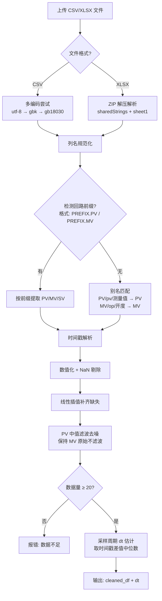
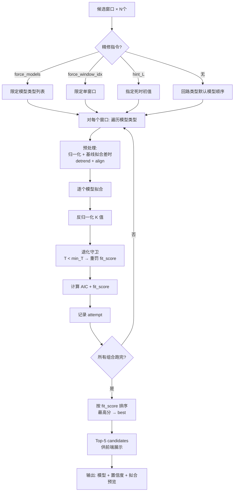
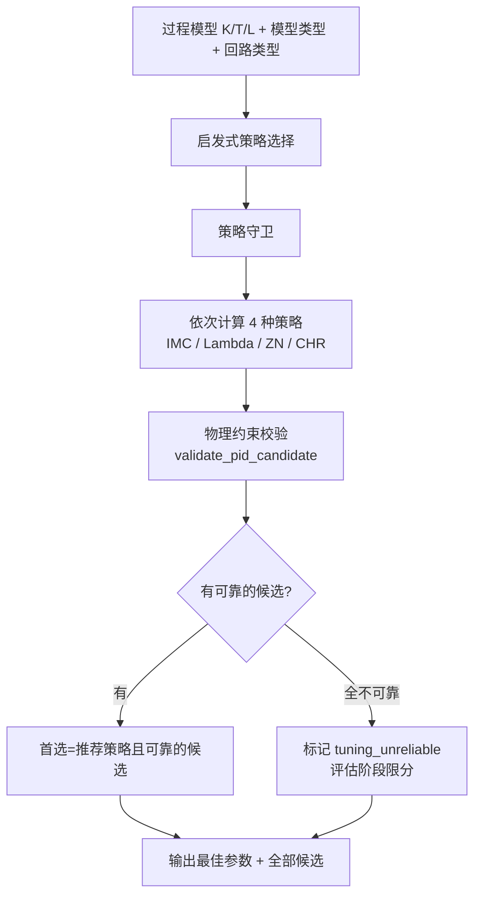
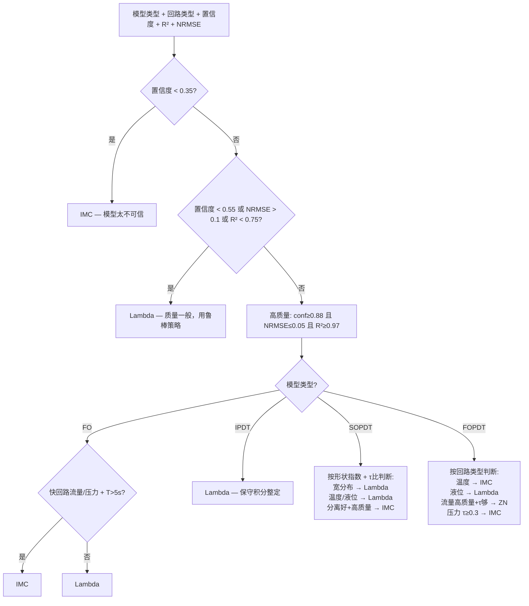
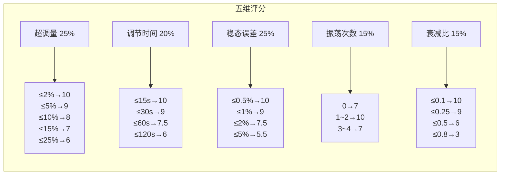
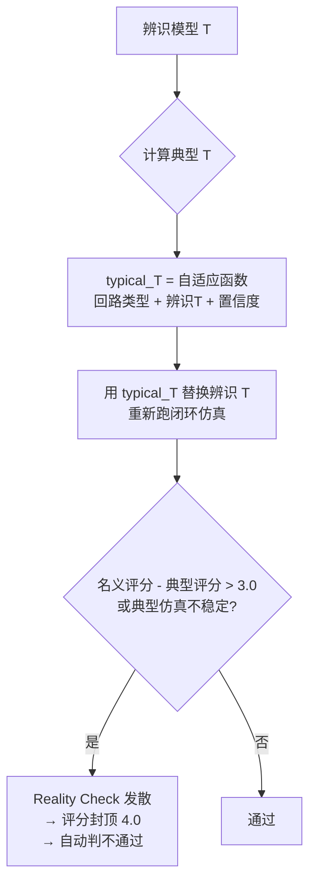

# PID V2 智能整定系统 — 算法设计文档

> 版本：V1.0  
> 更新日期：2026-04-25  
> 适用范围：`backend/core/algorithms/`、`backend/core/policies/`、`backend/core/providers/`

---

## 一、系统架构总览

```
┌─────────────────────────────────────────────────────────────────┐
│                        PID V2 整定流水线                          │
│                                                                   │
│  ┌──────────┐   ┌──────────────┐   ┌──────────┐   ┌──────────┐  │
│  │ 1.数据分析 │ → │ 2.系统辨识    │ → │ 3.PID整定 │ → │ 4.性能评估 │  │
│  │  加载CSV  │   │ 多窗口×多模型  │   │ 4策略生成  │   │ 闭环仿真  │  │
│  │  窗口检测  │   │ AIC最优选择   │   │ 启发式推荐  │   │ 评分+兜底  │  │
│  │  质量评分  │   │ 置信度评估    │   │ 物理校验    │   │ Reality   │  │
│  └──────────┘   └──────────────┘   └──────────┘   └──────────┘  │
│       │               │                 │               │        │
│       ▼               ▼                 ▼               ▼        │
│  候选窗口列表    过程模型+置信度     PID参数候选     通过/不通过   │
│  数据画像        K/T/L/R²/NRMSE    Kp/Ki/Kd/Ti/Td  评分+建议    │
└─────────────────────────────────────────────────────────────────┘
```

---

## 二、Stage 1：数据分析

**代码位置**：`core/algorithms/data_analysis.py`、`core/algorithms/signal_processing.py`

### 2.1 数据加载与清洗



**关键设计点**：

| 设计点 | 说明 |
|--------|------|
| 列名规范化 | 三套策略依次尝试：`PREFIX.PV/MV` 多位号格式 → 别名匹配（支持中英文）→ 直接赋值。XLSX 额外扫描前 80 行找表头行 |
| 时间戳解析 | 数值列自动判断 ms/s 单位；字符串列 `pd.to_datetime` 推断；时区统一为 Asia/Shanghai |
| **PV 滤波仅用中值滤波** | 不用 Butterworth 等平滑滤波器，因为会抹平阶跃边缘，导致死时估计偏差。MV **绝不滤波**，保留阶跃信息 |
| **采样周期 dt** | 取相邻时间戳差值的 **中位数**（抗异常间隔干扰），而非均值 |

### 2.2 候选窗口检测

系统使用四层检测策略，从显式阶跃到静默扰动逐级扫描：

```mermaid
flowchart TD
    A[cleaned_df] --> B{SV 列存在且变化?}
    B -->|是| C[SV 阶跃检测<br/>阈值 = max(0.5, 6×SV噪声)]
    B -->|否| D[跳过 SV 检测]
    C --> E[合并去重<br/>邻近 40 点内的合并]
    D --> E
    
    A --> F[MV 尖峰检测<br/>阈值 = max(8×MV噪声, 5%量程)<br/>Top-8 按幅值排序]
    F --> G[MV 活动段检测<br/>滑动窗口 30s/60s/120s<br/>净变化 > 10×噪声]
    G --> H[静默扰动段扫描<br/>滑窗扫描整段数据<br/>score_window 评分过滤]
    H --> E
    
    E --> I[候选窗口构建<br/>按 loop_type 自适应 padding]
    I --> J[窗口质量评分<br/>score_window()]
    J --> K[按质量分降序排列<br/>标记可用/不可用]
    K --> L[输出: candidate_windows + step_events]
```

**自适应窗口 Padding**（`_adaptive_padding`）：

| 回路类型 | 阶跃后窗口长度 | 阶跃前基线 | 理由 |
|----------|---------------|-----------|------|
| 流量 (flow) | 120s | 20~60s | T 通常 1~10s，120s 远超 3~5 倍 |
| 压力 (pressure) | 300s | 20~60s | T 通常 5~60s |
| 温度 (temperature) | 1800s (30min) | 20~60s | T 可达 60~600s |
| 液位 (level) | 2400s (40min) | 20~60s | 积分型或 T 数百秒 |
| 默认 | 300s | 20~60s | |

上限 = `max(200, n//4)` 点，防止单个窗口吃下整个数据集。

### 2.3 窗口质量评分 `score_window()`

```
        0.4 × MV激励评分   + 0.4 × PV响应评分   + 0.2 × 互相关评分
总分 = ───────────────────────────────────────────────────────────────
                     × 饱和惩罚因子 × 漂移惩罚因子
```

| 分量 | 计算方式 | 阈值 |
|------|---------|------|
| **MV 激励** | `MV量程 ≥ max(12×MV噪声, 1e-6)` 且 `MV标准差 ≥ max(4×MV噪声, 1e-6)` → 1.0；否则按比例衰减 | 量程/12 |
| **PV 响应** | 同上逻辑用 PV 量程和 PV 噪声 | 量程/10 |
| **互相关** | 搜索正滞后 0~min(N/4, 50) 步的最大归一化互相关系数，`min(corr/0.4, 1.0)` | corr≥0.05 |
| **饱和惩罚** | `1.0 - min(饱和比例/0.6, 1.0) × 0.7` | 饱和>60%直接不可用 |
| **漂移惩罚** | `1.0 - min(漂移比例/1.0, 1.0) × 0.25` | 线性拟合斜率 |

**窗口可用判定**：`MV_eff ∧ PV_eff ∧ corr ≥ 0.05 ∧ 饱和 ≤ 60%`。

---

## 三、Stage 2：系统辨识

**代码位置**：`core/algorithms/system_id.py`

### 3.1 辨识总流程



### 3.2 模型类型与参数

| 模型 | 传递函数 | 参数 | 自由参数数 |
|------|---------|------|-----------|
| **FO** | `K/(Ts+1)` | K, T | 2 |
| **FOPDT** | `K·exp(-Ls)/(Ts+1)` | K, T, L | 3 |
| **SOPDT** | `K·exp(-Ls)/((T1s+1)(T2s+1))` | K, T1, T2, L | 4 |
| **SOPDT_UNDER** | `K·exp(-Ls)/(T²s²+2ζTs+1)`, `0<ζ<1` | K, T, ζ, L | 4 |
| **IPDT** | `K·exp(-Ls)/s` | K, L | 2 |
| **IFOPDT** | `K·exp(-Ls)/(s·(Ts+1))` | K, T, L | 3 |

**回路类型默认模型优先级**（`loop_priors.py`）：

| 回路 | 优先顺序 | 最小合理 T |
|------|---------|-----------|
| 流量 (flow) | FO > FOPDT > SOPDT > SOPDT_UNDER > IPDT | 1s |
| 压力 (pressure) | FO > FOPDT > SOPDT > SOPDT_UNDER > IPDT | 5s |
| 温度 (temperature) | SOPDT > FOPDT > FO > IPDT | 30s |
| 液位 (level) | IFOPDT > IPDT > FOPDT > FO > SOPDT | 60s |

### 3.3 拟合算法详解

#### 3.3.1 死时估计（归一化互相关）

```python
# 核心代码
for lag in 0..max_lag:  # 只搜索正 lag（MV 领先 PV）
    corr = mean(mv[0:-lag] × pv[lag:]) / (mv_std × pv_std)
# max_lag = min(60s窗口, N/4)
# 拒绝 corr < 0.1 的微弱相关
```

#### 3.3.2 归一化策略

**偏差变量归一化**（非 standardization）：
- `mv_d = mv - mv[0]`（减初始值）
- `pv_d = pv - pv[0]`
- 除以各自的 `max(|·|)`（量程归一化）
- 好处：保留物理增益比 K = ΔPV/ΔMV，不被标准差扭曲

#### 3.3.3 优化方法与多起点

| 模型 | 优化参数 | 多起点策略 |
|------|---------|-----------|
| FO | K, T | 单起点，T_init = max(5dt, window/6) |
| **FOPDT** | K, T, L | 5 个 L 初值：0, hint, 0.1Lmax, 0.25Lmax, 0.5Lmax |
| SOPDT | K, T_sum, ratio, L | 参数化 T1, T2 = T_sum×ratio, T_sum×(1-ratio) |
| **SOPDT_UNDER** | K, T, ζ, L | 4 个 ζ 初值：0.2, 0.4, 0.6, 0.8 |
| IPDT | K, L | K_init 用 `cov(PV, ∫MV)/var(∫MV)` 线性回归 |
| **IFOPDT** | K, T, L | 2 个 T 初值：小（接近 IPDT）和中（明显一阶） |

所有拟合使用 `scipy.optimize.minimize(method="L-BFGS-B")`。

#### 3.3.4 预处理：去趋势与对齐

当基线 FOPDT 拟合 `r2 < 0.3` 或 `nrmse > 0.5` 时触发：

1. **PV 去趋势**：线性拟合，漂移超过量程 35% 时移除趋势
2. **MV/PV 对齐**：归一化互相关搜索正向滞后（因果约束），相关系数 < 0.1 不生效

### 3.4 模型选择与评分

#### 拟合分数 `fit_score`

```
fit_score = 10.0 × (0.6 × R² + 0.4 × (1 - NRMSE)) — 0.005 × AIC
```

#### AIC 惩罚

```
AIC = N × ln(RMSE² × N / N) + 2 × n_params
    = N × ln(NRMSE² × N) + 2 × n_params
```

参数多的模型（SOPDT 4 参数 > FOPDT 3 参数）受到更大的 AIC 惩罚。

#### 退化模型守卫

若拟合出的有效时间常数 `T_eff < min_reasonable_T`（按回路类型），`fit_score -= 100` 重罚，强制让位给更合理的模型。

```
FO/FOPDT:       T_eff = T
SOPDT:          T_eff = T1 + T2
SOPDT_UNDER:    T_eff = T
IPDT/IFOPDT:    不参与 T 退化守卫（积分对象 T 无意义）
```

### 3.5 置信度 `_confidence()`

```mermaid
flowchart TD
    A[R² + NRMSE + N个点] --> B{样本量 N < 200?}
    B -->|是| C[降低 R² 权重<br/>R²_weight = 0.65 - 0.2×(200-N)/150<br/>RMSE参考放宽]
    B -->|否| D[R²_weight = 0.65<br/>RMSE参考 = 0.35]
    C --> E[RMSE_score = max(0, 1-(NRMSE/ref)^1.2)]
    D --> E
    E --> F[conf = R²_weight×R² + (1-R²_weight)×RMSE_score]
    F --> G{漂移 > 30%?}
    G -->|是| H[× (1-(drift-0.3)/0.7×0.18)]
    G -->|否| I
    H --> I{饱和 > 25%?}
    I -->|是| J[× (1-(sat-0.25)/0.5×0.15)]
    I -->|否| K
    J --> K{R² < 0.4?}
    K -->|是| L[conf 封顶 0.45]
    K -->|否| M
    L --> M{R² < 0.25?}
    M -->|是| N[conf 封顶 0.30]
    M -->|否| O[输出: conf ∈ [0,1]]
    N --> O
```

**置信度定级**：

| 置信度 | 定级 | 建议 |
|--------|------|------|
| ≥ 0.80 | excellent | 模型可信，可直接用于 PID 整定 |
| 0.65~0.80 | good | 基本可信，建议结合现场经验校核 |
| 0.45~0.65 | fair | 偏低，建议复查数据窗口 |
| < 0.45 | poor | 不可依，建议重新采集数据 |

---

## 四、Stage 3：PID 整定

**代码位置**：`core/algorithms/pid_tuning.py`、`core/providers/tuning/`

### 4.1 整定总流程



### 4.2 四种整定策略

#### IMC（内模控制）

保守策略，适合高精度要求场景。以 `λ = max(L, 0.8T)` 为调谐参数。

```
FOPDT:  Kp = T/(|K|×(λ+L))    Ti = T      Td = 0.5L
SOPDT:  λ = max(1.6×Lwork, Twork×(0.90+0.20×shape))
        Kp = Twork/(|K|×(λ+Lwork))
        Ti = 主时常 + (0.75+0.20×shape)×次时常 + 0.25×Lwork
        Td = min(次时常×(0.16+0.12×shape), td_ceil)
IPDT:   Kp = 1/(|K|×(2.5L+L))     Ti = 4L    Td = 0
```

#### Lambda

最鲁棒的默认策略。`λ = max(1.5L, T)`：

```
FOPDT:  Kp = T/(|K|×(λ+L))    Ti = T+0.5L    Td = 0
SOPDT:  λ = max(2.0×Lwork, Twork×(1.05+0.30×shape))
        Ti = 主时常 + (1.05+0.35×shape)×次时常 + 0.45×Lwork
IPDT:   Kp = 1/(|K|×(2.5L+L))    Ti = 4L
```

#### Ziegler-Nichols（ZN）

激进策略，仅高置信度流量回路使用：

```
FOPDT:  Kp = 1.2T/(|K|×L)    Ti = 2L    Td = 0.5L
SOPDT:  等效 Lwork 计算后，Kp = 0.55×Twork/(|K|×Lwork)
IPDT:   Kp = 0.35/(|K|×L)    Ti = 3.5L
```

#### CHR（Chien-Hrones-Reswick，0% 超调）

保守无超调策略：

```
FOPDT:  Kp = 0.6T/(|K|×L)    Ti = T    Td = 0.5L
SOPDT:  等效 Lwork 计算后，Kp = 0.38×Twork/(|K|×Lwork)
```

### 4.3 启发式策略选择 `_heuristic_strategy()`



### 4.4 物理约束校验 `validate_pid_candidate()`

```python
Ti_min 按回路类型配置:
    流量: 2s    压力: 10s    温度: 60s    液位: 60s

PB = 100/Kp  必须在 [5%, 1000%] 范围内
```

校验不通过则标记 `unreliable=True`，评估阶段触发评分封顶。

---

## 五、Stage 4：性能评估

**代码位置**：`core/algorithms/pid_evaluation.py`、`core/policies/scoring_rules.py`

### 5.1 闭环仿真 `_simulate()`

```mermaid
flowchart TD
    A[输入: 模型参数 + PID参数] --> B[初始化<br/>SP从50→60 阶跃<br/>积分抗饱和 ±100/Ki<br/>微分抗饱和<br/>MV限幅 0~100%]
    B --> C[每时间步:<br/>1. 计算误差 e = SP-PV<br/>2. 积分累加 + 抗饱和<br/>3. 微分 = (e-e_prev)/dt<br/>4. MV = mv0 + Kp×e + Ki×∫e + Kd×de/dt<br/>5. MV限幅到 [0,100]<br/>6. 模型响应: 一阶/FOPDT/SOPDT/IPDT]
    C --> D[500~600步仿真完成]
    D --> E[计算时域指标:<br/>超调量/调节时间/稳态误差<br/>振荡次数/衰减比/上升时间]
    E --> F[稳定性判定:<br/>调节时间<类型阈值<br/>且SSE<8% 且衰减<0.8<br/>且超调<65%(衰减≤0.6时)]
```

**模型响应差分方程**（以 FOPDT 为例）：

```
α = dt/(T+dt),  d = round(L/dt)
y[i] = (1-α)×y[i-1] + K×α×u[i-d]
```

### 5.2 评分体系（三层）

#### Layer 1：闭环性能评分（0~10）



**不稳定罚分**（替代旧版 0.4× 全局乘子）：逐项扣分，每项 1.0~2.5 分，总罚分上限 4.0。

#### Layer 2：鲁棒性评估

对模型做 **3 组扰动**（K±10%、T±10%、L±20%），用同样 PID 参数重新仿真：

```python
变体 1: K×0.9, T×0.9, L×1.2
变体 2: K×1.1, T×1.1, L×0.9
变体 3: K×1.0, T×1.2, L×1.2
```

鲁棒评分 = `0.6 × min(3个分数) + 0.4 × mean(3个分数)`

#### Layer 3：综合评分

```
就绪评分 = 0.45×性能 + 0.20×反向阶跃 + 0.20×鲁棒 + 0.15×MV约束

最终评分 = 0.7 × 性能评分 + 0.3 × 置信度 × 10.0
```

### 5.3 Reality Check（自检机制）



**典型 T 计算**（`adaptive_reality_check_t`）：

| 回路类型 | 典型 T 范围 | 算法 |
|----------|-----------|------|
| 流量 | 3~20s | `clamp(辨识T, lo, hi)` 偏慢侧拉 |
| 压力 | 15~120s | `max(lo, min(hi, 辨识T × slow_factor))` |
| 温度 | 120~1200s | `slow_factor = 1.15 + 0.55×(1-置信度)` |
| 液位 | 300~1800s | 置信度越低 → slow_factor 越大 |

### 5.4 评分封顶规则

| 触发条件 | 性能封顶 | 就绪封顶 | 最终封顶 | 自动不通过 |
|----------|---------|---------|---------|-----------|
| 置信度 < 0.5 | 5.0 | 5.0 | 5.0 | ✓ |
| Reality Check 发散 | 4.0 | 4.0 | 4.0 | ✓ |
| 整定参数物理不合理 | 3.0 | 3.0 | 3.0 | ✓ |
| 综合评分 < 7.0 | — | — | — | ✓ |
| MV 饱和 > 35% | — | — | — | ✓ |

---

## 六、信号处理

**代码位置**：`core/algorithms/signal_processing.py`

### 6.1 PV 去噪：中值滤波

```
滤波器: scipy.ndimage.median_filter
核大小: 低噪声→3, 中噪声→5, 高噪声→9
噪声判定: diff(PV)标准差 / PV标准差 <0.05→低, <0.15→中, ≥0.15→高
```

**选择中值滤波的理由**：边缘保持性好，不会像 Butterworth 那样抹平阶跃边缘，死时估计更准确。

### 6.2 MV：绝不滤波

MV 信号包含阶跃和脉冲信息，平滑会丢失死时和增益的关键特征。

### 6.3 去趋势

当线性漂移超过量程 35% 时触发：`pv_detrended = pv - (slope×x + intercept)`

### 6.4 时序对齐

归一化互相关，**只搜索正向滞后**（因果约束：MV 必须领先 PV）。相关性 > 0.1 才接受对齐。

---

## 七、关键数据结构

### 7.1 候选窗口

```python
{
    "window_source": "sv_step_1",        # 窗口命名
    "window_start_idx": 150,             # 起始行号
    "window_end_idx": 500,               # 结束行号
    "window_usable_for_id": True,        # 可用于辨识
    "window_quality_score": 0.872,       # 质量分 [0,1]
    "window_algorithm": "sv_step",       # 来源: sv_step/mv_step/mv_ramp/steady_disturbance
    "window_mv_span": 12.5,              # MV 量程
    "window_pv_span": 8.3,               # PV 量程
    "window_corr": 0.76,                 # 互相关
    "window_drift_ratio": 0.12,          # 漂移比例
    "window_score_breakdown": {          # 评分明细
        "mv_excitation": 0.95, "pv_response": 0.88,
        "lag_correlation": 0.72, ...
    }
}
```

### 7.2 过程模型

```python
ProcessModel(
    model_type="FOPDT",     # FO/FOPDT/SOPDT/IPDT/SOPDT_UNDER/IFOPDT
    K=2.35,                 # 静态增益
    T=8.5, T1=8.5, T2=0,  # 时间常数（秒）
    L=1.2,                  # 死时（秒）
    zeta=0.0,               # 阻尼比（仅 SOPDT_UNDER）
    r2_score=0.942,         # R² ∈ [0,1]
    normalized_rmse=0.032,  # NRMSE
    raw_rmse=0.28,          # 原始 RMSE（物理单位）
    success=True
)

ModelConfidence(
    confidence=0.92,        # 综合置信度 [0,1]
    quality="excellent",    # excellent/good/fair/poor
    recommendation="...",
    r2_score=0.942,
    rmse_score=0.91
)
```

### 7.3 PID 参数候选

```python
{
    "strategy": "IMC",
    "Kp": 2.35, "Ki": 0.276, "Kd": 0.71,
    "Ti": 8.5, "Td": 0.6,
    "description": "Conservative IMC",
    "is_recommended": True,
    "unreliable": False,       # 物理校验未通过
}
```

---

## 八、算法改进记录（相对 pid_new）

| 编号 | 改进点 | 文件 | 说明 |
|------|--------|------|------|
| #1 | MV 阶跃检测 | data_analysis | 新增 `_detect_mv_steps` 和 `_detect_mv_activity_segments`，支持无 SV 的人工操作数据 |
| #2 | 自适应窗口长度 | data_analysis | 按回路类型动态计算阶跃后窗口长度，而非固定比例 |
| #3 | 质量排序选窗 | data_analysis | 改幅值排序为质量评分排序 |
| #4 | 滞后互相关 | data_analysis | `score_window` 不再只计算零滞后 |
| #5 | 正滞后死时 | system_id + signal_processing | 归一化互相关只搜索正滞后，因果约束 |
| #6 | 偏差归一化 | system_id | `(x-x0)/span` 而非 `(x-μ)/σ`，保护增益物理意义 |
| #7 | L 上界约束 | system_id | L ≤ min(window/4, Tmax/2)，防止死时吸收时间常数 |
| #8 | FOPDT 多起点 | system_id | L 初值 5 点搜索，避免局部极小 |
| #10 | SOPDT 参数化 | system_id | T_sum + ratio 替代 T1+T2，确保 T1≥T2 |
| #11 | AIC 模型选择 | system_id | 加参数复杂度惩罚，避免过拟合 |
| #12 | 小样本 R² 降权 | system_id | N<200 时降低 R² 权重，放宽 RMSE 参考 |
| #13 | PV 中值滤波 | signal_processing | 只用中值滤波，不用 Butterworth；MV 绝不滤波 |
| #14 | 稳定域罚分 | pid_evaluation | 替代 0.4× 全局乘子，逐项扣分避免"全好但分低" |
| steady | 静默扰动扫描 | data_analysis | 扫描完整历史数据查找可用辨识段 |

---

## 九、文件索引

| 模块 | 文件 | 核心功能 |
|------|------|---------|
| 数据分析 | `core/algorithms/data_analysis.py` | CSV/XLSX 加载、列识别、窗口检测、质量评分 |
| 信号处理 | `core/algorithms/signal_processing.py` | 中值滤波、去趋势、MV/PV 对齐 |
| 系统辨识 | `core/algorithms/system_id.py` | 6 种模型拟合、AIC 选择、置信度计算 |
| PID 整定 | `core/algorithms/pid_tuning.py` | 4 种策略、启发式选择 |
| 性能评估 | `core/algorithms/pid_evaluation.py` | 闭环仿真、三层评分、Reality Check |
| 回路先验 | `core/policies/loop_priors.py` | 模型优先级、最小 T、典型 T 范围 |
| 评分规则 | `core/policies/scoring_rules.py` | 综合评分公式、封顶规则、Reality Check T |
| 物理约束 | `core/policies/constraints.py` | Ti 下限、PB 范围校验 |
| 调优 Provider | `core/providers/tuning/classic_family.py` | 聚合 4 种策略 + 约束校验 |
| 评估 Provider | `core/providers/evaluation/closed_loop_sim.py` | 聚合仿真 + 评分 + Reality Check |
| 辨识 Provider | `core/providers/identification/transfer_function_fit.py` | fit_best_model 的 provider 包装 |
| 死时 Provider | `core/providers/dead_time/cross_correlation.py` | 交叉相关死时估计 |
